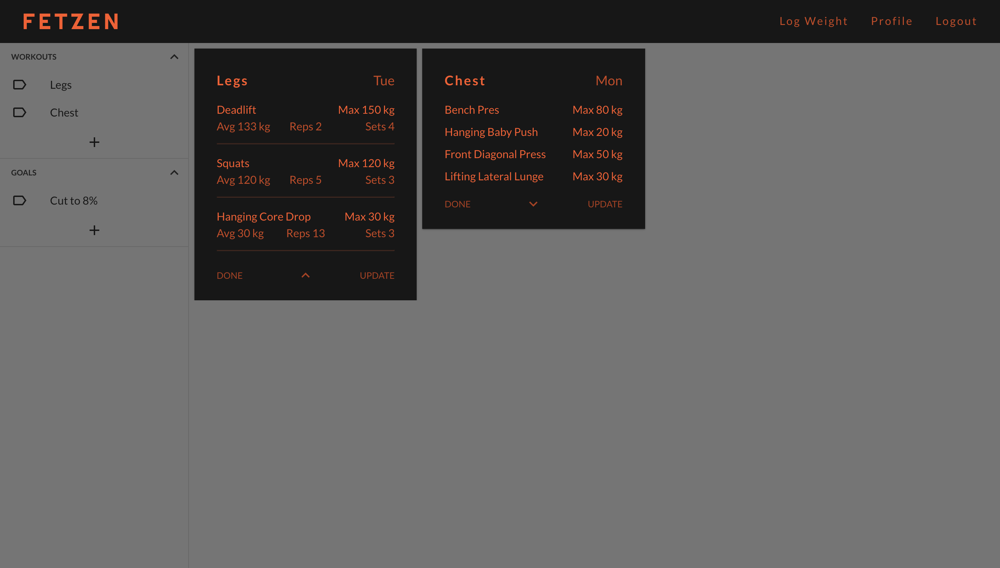
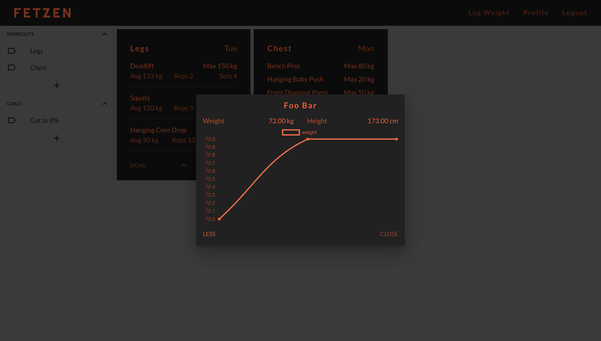

# FETZEN
The workout tracker.

### Links
- [The App](https://18alantom.github.io/fetzen)
- [The API server](https://github.com/18alantom/fetzen-backend)

### What was used to make it?
- [React](https://reactjs.org/), a frontend Javascript library.
- [Material-UI](https://material-ui.com/), a component library for React which allows for customization of baseline material design based components.

### What does it look like?
A few of the pages from the web app.

#### Register

Photo by [Victor Freitas](https://www.pexels.com/@victorfreitas) from Pexels

#### Dashboard
The layout is dynamic.

#### Weight Tracking Graph
Tracking of weight, plotting using [chart.js](https://www.chartjs.org/)

### What does it do?
- The app tracks user entered workouts. 
- Each workout consists of exercises. 
- The app shows stats related to these exercises.
- The app also tracks the weight of an individual along with goals.

### Why was it made?
- For a college web development course project.

